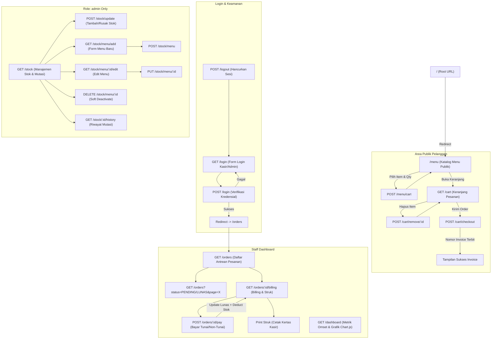
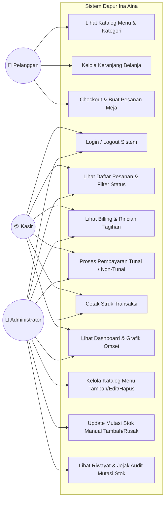
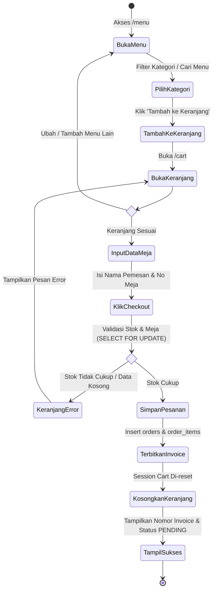
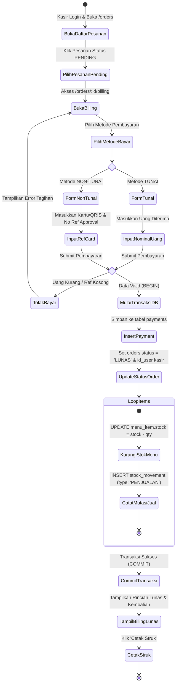
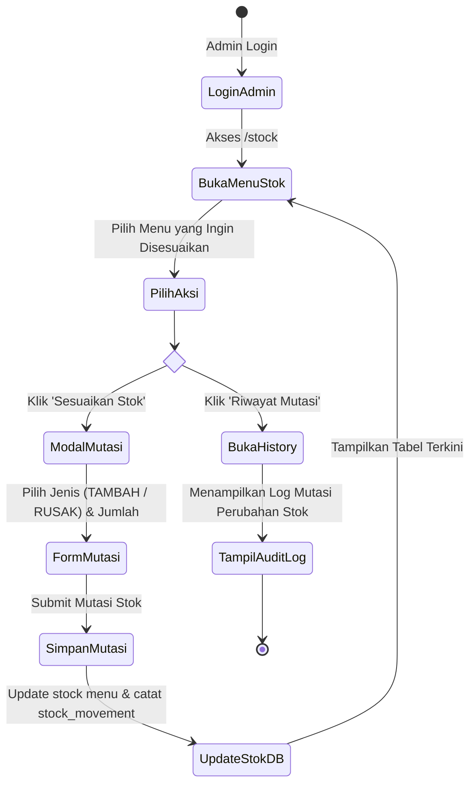
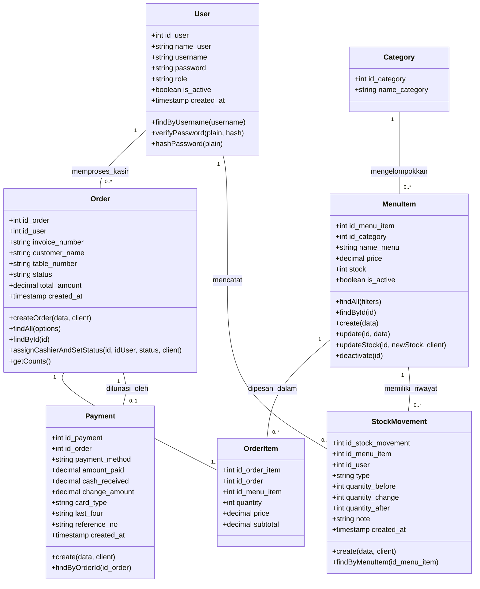
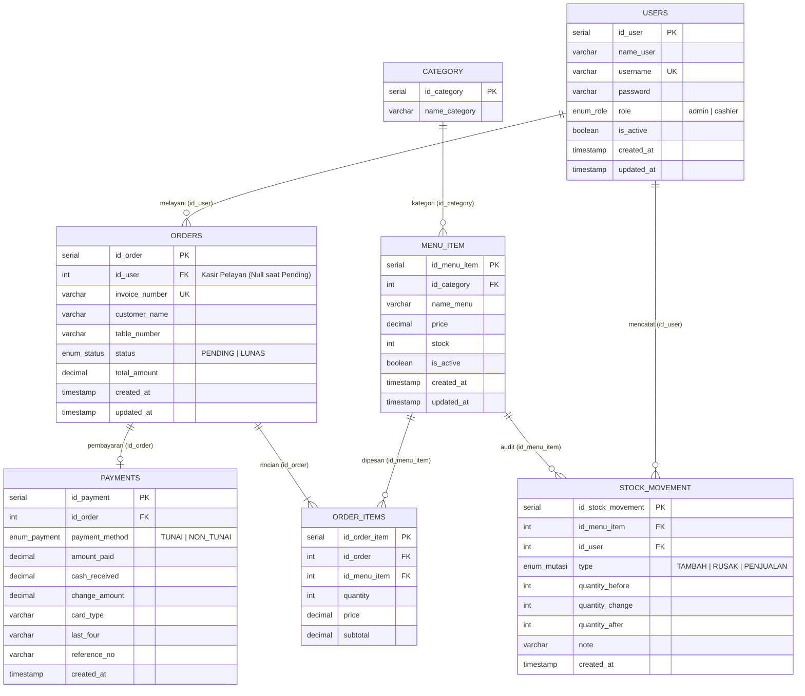

# 📖 Dokumentasi Lengkap & Rangkuman Sistem — Dapur Ina Aina

Sistem Informasi Manajemen Pemesanan, Kasir, dan Mutasi Stok Restoran & Cafe berbasis Web (**Express.js + PostgreSQL + EJS**).

---

## 📑 Daftar Isi
1. [Gambaran Umum Sistem](#1-gambaran-umum-sistem)
2. [Arsitektur & Tech Stack](#2-arsitektur--tech-stack)
3. [Fitur Utama & Fungsionalitas](#3-fitur-utama--fungsionalitas)
4. [Struktur Direktori Proyek](#4-struktur-direktori-proyek)
5. [Struktur Navigasi & Alur Routing](#5-struktur-navigasi--alur-routing)
6. [Diagram UML](#6-diagram-uml)
   - [6.1 Use Case Diagram](#61-use-case-diagram)
   - [6.2 Activity Diagram — Pemesanan Pelanggan](#62-activity-diagram--alur-pemesanan-pelanggan)
   - [6.3 Activity Diagram — Pembayaran Kasir & Pengurangan Stok](#63-activity-diagram--alur-pembayaran-kasir--pengurangan-stok)
   - [6.4 Activity Diagram — Penyesuaian Mutasi Stok Admin](#64-activity-diagram--alur-penyesuaian-mutasi-stok-admin)
   - [6.5 Class Diagram (Arsitektur Model & Database)](#65-class-diagram)
7. [Skema Database & Relasi (ERD)](#7-skema-database--relasi-erd)
8. [Akun & Hak Akses (RBAC)](#8-akun--hak-akses-rbac)
9. [Panduan Instalasi & Menjalankan](#9-panduan-instalasi--menjalankan)

---

## 1. Gambaran Umum Sistem

**Dapur Ina Aina** adalah aplikasi manajemen restoran modern yang dirancang untuk:
- Memudahkan **Pelanggan** melihat buku menu interaktif secara mandiri, memilih makanan/minuman ke keranjang, dan melakukan pemesanan langsung dari meja makan mereka.
- Membantu **Kasir** memproses tagihan/billing, menerima pembayaran (Tunai / Non-Tunai), menghitung uang kembalian secara otomatis, dan mencetak struk kasir digital.
- Membantu **Administrator** memantau performa penjualan lewat analitik dashboard grafis 7 hari, memantau menu berstok rendah (*low stock warning*), mengelola katalog menu, serta mencatat mutasi penyesuaian stok (*Stock In / Rusak / Penjualan*).

---

## 2. Arsitektur & Tech Stack

Sistem dibangun menggunakan pola **MVC (Model-View-Controller)**:

- **Backend Runtime**: [Node.js](https://nodejs.org/) (v18+)
- **Web Framework**: [Express.js](https://expressjs.com/)
- **Database**: [PostgreSQL](https://www.postgresql.org/) (didukung *connection pooling* via `pg`)
- **Template Engine**: [EJS (Embedded JavaScript Templates)](https://ejs.co/)
- **Styling UI/UX**: Custom Modern CSS Design System (Glassmorphism, Vibrant Palette, Micro-animations, Print Receipt Styling)
- **Visualisasi Grafik**: [Chart.js](https://www.chartjs.org/) (Dashboard pendapatan & omset)
- **Keamanan & Middleware**:
  - `bcrypt`: Hashing password aman
  - `express-session` + `connect-pg-simple`: Manajemen sesi terenkripsi yang persisten di PostgreSQL
  - `helmet`: Pengaturan HTTP Security Headers
  - `morgan`: Request HTTP Logger
  - `method-override`: Dukungan HTTP verbs `PUT` dan `DELETE` dari form HTML

---

## 3. Fitur Utama & Fungsionalitas

| ID | Fitur | Deskripsi | Aktor |
|---|---|---|---|
| **FR-1** | Katalog Menu Interaktif | Pelanggan dapat menjelajahi menu per kategori, melihat ketersediaan stok, harga, dan foto | Pelanggan |
| **FR-2** | Keranjang & Checkout Mandiri | Menambahkan menu ke keranjang belanja, mengubah kuantitas, input nama & meja, checkout pesanan | Pelanggan |
| **FR-3** | Concurrency Stock Lock | Menggunakan transaksi database `SELECT ... FOR UPDATE` saat checkout untuk mencegah race-condition antar pelanggan | Sistem |
| **FR-4** | Daftar Pesanan & Filter | Kasir/Admin melihat antrean order dengan tab filter status (`SEMUA`, `PENDING`, `LUNAS`) dan paginasi | Kasir, Admin |
| **FR-5** | Billing & Struk Digital | Rincian invoice pesanan, rincian item, pajak/subtotal, status transaksi, tombol cetak struk (*print-ready*) | Kasir, Admin |
| **FR-6** | Pembayaran Tunai | Validasi uang diterima >= tagihan, hitung kembalian instan, update order status ke `LUNAS` | Kasir, Admin |
| **FR-7** | Pembayaran Non-Tunai | Pencatatan transaksi Debit/Kredit/QRIS lengkap dengan nomor referensi approval | Kasir, Admin |
| **FR-8** | Otomasi Mutasi Stok Penjualan | Stok produk langsung terpotong saat pesanan dilunasi, dicatat ke tabel mutasi sebagai `PENJUALAN` | Sistem |
| **FR-9** | Manajemen Stok & Katalog | Menambah menu baru, mengedit harga/nama/kategori, soft-delete menu nonaktif | Admin |
| **FR-10** | Penyesuaian Mutasi Stok | Mencatat mutasi manual (`TAMBAH` atau `RUSAK/EXPIRED`) beserta catatan/alasan penyesuaian | Admin |
| **FR-11** | Riwayat Audit Mutasi Stok | Riwayat jejak audit stok per menu: stok awal, perubahan (+/-), stok akhir, pencatat, & waktu | Admin |
| **FR-12** | Dashboard Analitik & Metrik | Grafik omset 7 hari terakhir, omset hari ini, total pesanan pending & lunas, tabel peringatan stok tipis | Admin, Kasir |
| **FR-13** | Role-Based Access Control | Pembatasan hak akses berbasis peran (`admin` vs `cashier`) pada tingkat middleware | Sistem |

---

## 4. Struktur Direktori Proyek

```text
dapur_ina_aina/
├── public/                     # Asset Statis Publik
│   ├── css/
│   │   └── style.css           # Desain Sistem & Komponen CSS Modern
│   └── js/
│       └── main.js             # Interaktivitas UI, Kalkulasi Kembalian, Print Struk
├── src/
│   ├── config/                 # Konfigurasi Inti
│   │   ├── db.js               # Pool Koneksi Database PostgreSQL
│   │   └── session.js          # Konfigurasi Session Store PostgreSQL
│   ├── controllers/            # Controller Logika Bisnis (MVC)
│   │   ├── authController.js       # Login & Logout Autentikasi
│   │   ├── customerController.js   # Katalog Menu, Keranjang, Checkout Pelanggan
│   │   ├── dashboardController.js  # Metrik & Grafik Dashboard
│   │   ├── orderController.js      # Daftar Pesanan & Detail Billing
│   │   ├── paymentController.js    # Eksekusi Pembayaran & Deduct Stok
│   │   └── stockController.js      # CRUD Menu & Mutasi Stok
│   ├── middlewares/            # Middleware
│   │   ├── auth.js             # Guard Autentikasi & RBAC (Role Checker)
│   │   └── errorHandler.js     # Error Handler Terpusat
│   ├── models/                 # Model Data & Kueri Database
│   │   ├── menuItemModel.js        # Kueri Menu & Kategori
│   │   ├── orderModel.js           # Kueri Header Pesanan & Items
│   │   ├── paymentModel.js         # Kueri Transaksi Pembayaran
│   │   ├── stockMovementModel.js   # Kueri Pencatatan Mutasi Stok
│   │   └── userModel.js            # Kueri Pengguna & Verifikasi Bcrypt
│   ├── routes/                 # Routing Endpoint
│   │   ├── authRoutes.js           # /login, /logout
│   │   ├── customerRoutes.js       # /menu, /menu/cart, /cart, /cart/checkout
│   │   ├── dashboardRoutes.js      # /dashboard
│   │   ├── orderRoutes.js          # /orders, /orders/:id/billing
│   │   ├── paymentRoutes.js        # /orders/:id/pay
│   │   └── stockRoutes.js          # /stock, /stock/update, /stock/menu/*
│   └── views/                  # Tampilan Antarmuka EJS
│       ├── auth/login.ejs          # Form Login Petugas
│       ├── customer/
│       │   ├── menu.ejs            # Katalog Menu Publik
│       │   └── cart.ejs            # Keranjang Belanja & Checkout
│       ├── dashboard/index.ejs     # Dashboard Utama
│       ├── orders/
│       │   ├── index.ejs           # Tabel Antrean Pesanan
│       │   └── billing.ejs         # Billing, Struk & Form Kasir
│       ├── stock/
│       │   ├── index.ejs           # Tabel Stok & Mutasi
│       │   ├── menu_form.ejs       # Form Tambah/Edit Menu
│       │   └── history.ejs         # Riwayat Log Mutasi Menu
│       ├── partials/
│       │   ├── header.ejs          # Navbar, Metadata, Layout Atas
│       │   └── footer.ejs          # Footer, Layout Bawah
│       └── errors/
│           ├── 404.ejs             # Halaman Not Found
│           └── 500.ejs             # Halaman Internal Error
├── tests/                      # Suite Pengujian Otomatis
│   ├── e2e_flow_test.js        # Uji Flow Pelanggan, Auth, Navigasi
│   └── e2e_advanced_test.js    # Uji Pembayaran, Mutasi Stok, RBAC
├── .env                        # Variabel Lingkungan Database & Port
├── package.json                # Dependensi Proyek
└── server.js                   # Entry Point Utama Aplikasi
```

---

## 5. Struktur Navigasi & Alur Routing



---

## 6. Diagram UML

### 6.1 Use Case Diagram



---

### 6.2 Activity Diagram — Alur Pemesanan Pelanggan



---

### 6.3 Activity Diagram — Alur Pembayaran Kasir & Pengurangan Stok



---

### 6.4 Activity Diagram — Alur Penyesuaian Mutasi Stok Admin



---

### 6.5 Class Diagram



---

## 7. Skema Database & Relasi (ERD)



---

## 8. Akun & Hak Akses (RBAC)

Aplikasi dilengkapi dengan sistem keamanan **Role-Based Access Control (RBAC)**:

| Peran (Role) | Kredensial Default | Hak Akses & Pembatasan |
|---|---|---|
| **Administrator** | Username: `admin`<br>Password: `admin123` | **Akses Penuh (Full Access)**:<br>- Dashboard analitik & grafik omset<br>- Manajemen & antrean pesanan<br>- Proses billing kasir & cetak struk<br>- Manajemen stok produk & input mutasi<br>- Tambah/Edit/Hapus menu masakan |
| **Kasir (Cashier)** | Username: `kasir1`<br>Password: `kasir123` | **Operasional Kasir**:<br>- Melihat antrean pesanan meja<br>- Memproses pembayaran (Tunai & Non-Tunai)<br>- Mencetak struk transaksi pelanggan<br>- *Dilarang (403 Forbidden) mengakses menu stok & katalog* |
| **Pelanggan (Publik)**| *Tanpa Login* | **Pemesanan Mandiri**:<br>- Melihat katalog buku menu & harga<br>- Mengelola keranjang belanja<br>- Checkout mandiri berdasarkan nomor meja |

---

## 9. Panduan Instalasi & Menjalankan

### Persyaratan Sistem
- [Node.js](https://nodejs.org/) v18 atau lebih baru
- [PostgreSQL](https://www.postgresql.org/) v14 atau lebih baru

### 1. Konfigurasi Environment (`.env`)
Pastikan file `.env` di root proyek telah dikonfigurasi:
```env
PORT=3000
DB_HOST=localhost
DB_PORT=5432
DB_USER=postgres
DB_PASSWORD=YOUR_POSTGRES_PASSWORD
DB_NAME=dapur_ina_aina
SESSION_SECRET=supersecret_session_key_dapur_ina_aina_2026
```

### 2. Menjalankan Server
```bash
# Menjalankan aplikasi
npm start
# atau
node server.js
```
Akses aplikasi melalui browser di: **http://localhost:3000**

### 3. Menjalankan Uji Otomatis (Automated Tests)
```bash
# Menjalankan seluruh skenario pengujian E2E (17/17 PASS)
node tests/e2e_flow_test.js
node tests/e2e_advanced_test.js
```

---
*Dokumentasi ini digenerate secara otomatis untuk proyek Dapur Ina Aina.*
