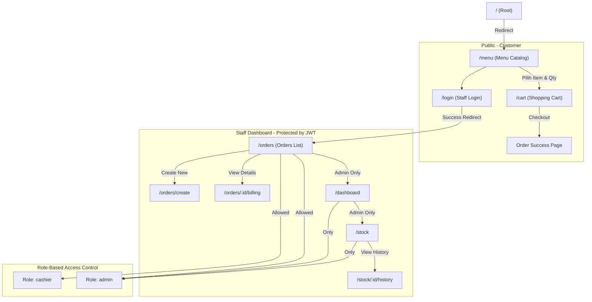
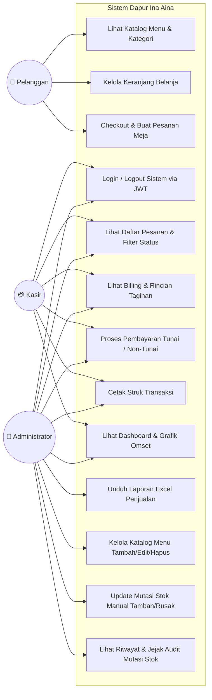
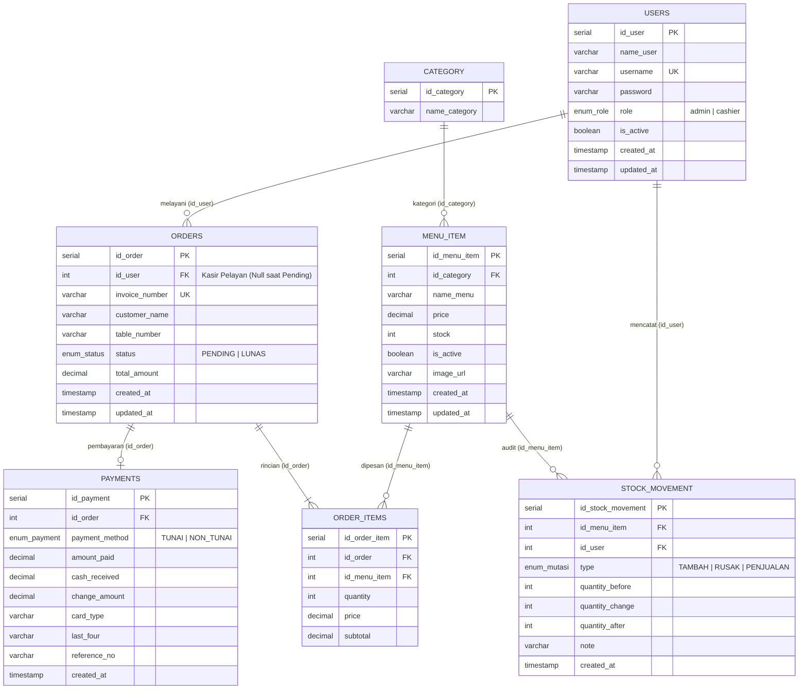

# 📖 Dokumentasi Lengkap & Rangkuman Sistem — Dapur Ina Aina

Sistem Informasi Manajemen Pemesanan, Kasir, dan Mutasi Stok Restoran & Cafe berbasis Web (**Monorepo: Express.js + React + PostgreSQL + Vite**).

---

## 📑 Daftar Isi
1. [Gambaran Umum Sistem](#1-gambaran-umum-sistem)
2. [Arsitektur & Tech Stack](#2-arsitektur--tech-stack)
3. [Fitur Utama & Fungsionalitas](#3-fitur-utama--fungsionalitas)
4. [Struktur Direktori Proyek](#4-struktur-direktori-proyek)
5. [Struktur Navigasi & Alur Routing](#5-struktur-navigasi--alur-routing)
6. [Diagram UML](#6-diagram-uml)
   - [6.1 Use Case Diagram](#61-use-case-diagram)
   - [6.2 Activity Diagram — Pemesanan Pelanggan](#62-activity-diagram--alur-pemesanan-pelanggan)
   - [6.3 Activity Diagram — Pembayaran Kasir & Pengurangan Stok](#63-activity-diagram--alur-pembayaran-kasir--pengurangan-stok)
   - [6.4 Activity Diagram — Penyesuaian Mutasi Stok Admin](#64-activity-diagram--alur-penyesuaian-mutasi-stok-admin)
   - [6.5 Class Diagram (Arsitektur Model & Database)](#65-class-diagram)
7. [Skema Database & Relasi (ERD)](#7-skema-database--relasi-erd)
8. [Akun & Hak Akses (RBAC)](#8-akun--hak-akses-rbac)
9. [Panduan Instalasi & Menjalankan](#9-panduan-instalasi--menjalankan)

---

## 1. Gambaran Umum Sistem

**Dapur Ina Aina** adalah aplikasi manajemen restoran modern yang dirancang untuk:
- Memudahkan **Pelanggan** melihat buku menu interaktif secara mandiri, memilih makanan/minuman ke keranjang, dan melakukan pemesanan langsung dari meja makan mereka.
- Membantu **Kasir** memproses tagihan/billing, menerima pembayaran (Tunai / Non-Tunai), menghitung uang kembalian secara otomatis, dan mencetak struk kasir digital.
- Membantu **Administrator** memantau performa penjualan lewat analitik dashboard grafis 7 hari, memantau menu berstok rendah (*low stock warning*), mengelola katalog menu, serta mencatat mutasi penyesuaian stok (*Stock In / Rusak / Penjualan*).

---

## 2. Arsitektur & Tech Stack

**Monorepo Architecture**: Dapur Ina Aina kini menggunakan pola monorepo dengan **React SPA** untuk frontend dan **Express.js REST API** untuk backend:

### Frontend (React SPA)
- **Framework**: React 19 + Vite (TypeScript/JSX)
- **Styling**: Tailwind CSS + CSS Modules
- **Routing**: React Router DOM v6
- **State Management**: React Context API + Zustand
- **Data Fetching**: Axios + React Query (@tanstack/react-query)
- **Charts**: Chart.js + react-chartjs-2
- **Icons**: Lucide React

### Backend (REST API)
- **Runtime**: Node.js (v18+)
- **Framework**: Express.js 4
- **Database**: PostgreSQL + pg (node-postgres)
- **Authentication**: JWT (JSON Web Tokens) + bcrypt
- **Validation**: Zod (schema validation)
- **Excel Export**: ExcelJS (untuk laporan Excel)
- **Security Middleware**: Helmet, CORS, express-rate-limit

---

## 3. Fitur Utama & Fungsionalitas

| ID | Fitur | Deskripsi | Aktor |
|---|---|---|---|
| **FR-1** | Katalog Menu Interaktif | Pelanggan dapat menjelajahi menu per kategori, melihat ketersediaan stok, harga, dan foto | Pelanggan |
| **FR-2** | Keranjang & Checkout Mandiri | Menambahkan menu ke keranjang belanja, mengubah kuantitas, input nama & meja, checkout pesanan | Pelanggan |
| **FR-3** | Concurrency Stock Lock | Menggunakan transaksi database `SELECT ... FOR UPDATE` saat checkout untuk mencegah race-condition antar pelanggan | Sistem |
| **FR-4** | Daftar Pesanan & Filter | Kasir/Admin melihat antrean order dengan tab filter status (`SEMUA`, `PENDING`, `LUNAS`) dan paginasi | Kasir, Admin |
| **FR-5** | Billing & Struk Digital | Rincian invoice pesanan, rincian item, pajak/subtotal, status transaksi, tombol cetak struk (*print-ready*) | Kasir, Admin |
| **FR-6** | Pembayaran Tunai | Validasi uang diterima >= tagihan, hitung kembalian instan, update order status ke `LUNAS` | Kasir, Admin |
| **FR-7** | Pembayaran Non-Tunai | Pencatatan transaksi Debit/Kredit/QRIS lengkap dengan nomor referensi approval | Kasir, Admin |
| **FR-8** | Otomasi Mutasi Stok Penjualan | Stok produk langsung terpotong saat pesanan dilunasi, dicatat ke tabel mutasi sebagai `PENJUALAN` | Sistem |
| **FR-9** | Manajemen Stok & Katalog | Menambah menu baru, mengedit harga/nama/kategori, soft-delete menu nonaktif | Admin |
| **FR-10** | Penyesuaian Mutasi Stok | Mencatat mutasi manual (`TAMBAH` atau `RUSAK/EXPIRED`) beserta catatan/alasan penyesuaian | Admin |
| **FR-11** | Riwayat Audit Mutasi Stok | Riwayat jejak audit stok per menu: stok awal, perubahan (+/-), stok akhir, pencatat, & waktu | Admin |
| **FR-12** | Dashboard Analitik & Metrik | Grafik omset 7 hari terakhir, omset hari ini, total pesanan pending & lunas, tabel peringatan stok tipis | Admin, Kasir |
| **FR-13** | Role-Based Access Control | Pembatasan hak akses berbasis peran (`admin` vs `cashier`) pada tingkat middleware | Sistem |
| **FR-14** | Laporan Excel Sales Report | Admin-only sales report dengan Excel download dan date range picker (tingkat meja) | Admin |

---

## 4. Struktur Direktori Proyek (Monorepo)

```text
dapur_ina_aina/ (ROOT MONOREPO)
├── backend/                    # Express.js REST API
│   ├── src/
│   │   ├── config/            # Konfigurasi Database, Middleware
│   │   │   ├── db.js          # PostgreSQL Pool Connection
│   │   │   └── session.js     # JWT Configuration
│   │   ├── controllers/       # Controller Business Logic
│   │   │   ├── authController.js      # Login, Logout, JWT Auth
│   │   │   ├── menuController.js      # CRUD Menu & Kategori
│   │   │   ├── orderController.js     # Order Management
│   │   │   ├── paymentController.js   # Payment Processing
│   │   │   ├── stockController.js     # Stock CRUD & Mutations
│   │   │   ├── dashboardController.js # Dashboard Analytics
│   │   │   └── reportController.js    # Excel Report Generation
│   │   ├── middlewares/       # Middleware Layers
│   │   │   ├── auth.js        # JWT Authentication & RBAC
│   │   │   ├── validator.js   # Zod Input Validation
│   │   │   └── errorHandler.js # Global Error Handler
│   │   ├── models/            # Database Models & Queries
│   │   │   ├── userModel.js          # Users & Authentication
│   │   │   ├── menuItemModel.js      # Menu Items & Categories
│   │   │   ├── orderModel.js         # Orders & Order Items
│   │   │   ├── paymentModel.js       # Payment Transactions
│   │   │   └── stockMovementModel.js # Stock Audit Trail
│   │   ├── routes/            # REST API Routes
│   │   │   ├── api.js         # Master Router /api/v1
│   │   │   ├── authRoutes.js          # /auth
│   │   │   ├── menuRoutes.js          # /menu
│   │   │   ├── orderRoutes.js         # /orders
│   │   │   ├── stockRoutes.js         # /stock (admin only)
│   │   │   ├── dashboardRoutes.js     # /dashboard (admin only)
│   │   │   └── reportRoutes.js        # /reports (admin only)
│   │   └── server.js          # Express Server Entry Point
│   ├── tests/                 # Automated Tests
│   │   └── e2e_flow.test.js   # E2E Test Suite
│   ├── scripts/               # Database & Migration Scripts
│   │   ├── update_passwords.js
│   │   └── migrate_add_image.js
│   └── package.json           # Backend Dependencies
├── frontend/                  # React SPA Application
│   ├── src/
│   │   ├── components/        # Reusable UI Components
│   │   │   ├── ui/            # Base UI Components
│   │   │   │   ├── Toast.jsx          # Notification Toast
│   │   │   │   ├── Modal.jsx          # Dialog Modal
│   │   │   │   ├── LoadingSkeleton.jsx
│   │   │   │   ├── KpiCard.jsx        # KPI Stat Card
│   │   │   │   └── EmptyState.jsx     # Empty State UI
│   │   │   ├── customer/      # Customer-Facing Components
│   │   │   │   ├── MenuCard.jsx       # Menu Item Card
│   │   │   │   └── CategoryPills.jsx  # Category Filter Pills
│   │   │   ├── admin/         # Admin Dashboard Components
│   │   │   │   ├── StatCard.jsx       # Dashboard Stats
│   │   │   │   ├── RevenueChart.jsx   # Revenue Charts
│   │   │   │   ├── OrderTable.jsx     # Orders Table
│   │   │   │   └── LowStockAlert.jsx  # Low Stock Alerts
│   │   │   └── layout/        # Layout Components
│   │   │       ├── Header.jsx         # Navigation Header
│   │   │       └── Footer.jsx         # Page Footer
│   │   ├── pages/            # Page Components
│   │   │   ├── auth/LoginPage.jsx     # Login Page
│   │   │   ├── customer/              # Customer Pages
│   │   │   │   ├── MenuPage.jsx       # Menu Catalog
│   │   │   │   └── CartPage.jsx       # Shopping Cart
│   │   │   └── admin/                 # Admin Pages
│   │   │       ├── DashboardPage.jsx  # Analytics Dashboard
│   │   │       ├── OrdersPage.jsx     # Orders Management
│   │   │       ├── CreateOrderPage.jsx # Create New Order
│   │   │       ├── BillingPage.jsx    # Billing & Payment
│   │   │       ├── StockPage.jsx      # Stock Management
│   │   │       └── StockHistoryPage.jsx # Stock Audit History
│   │   ├── context/          # React Context Providers
│   │   │   ├── AuthContext.jsx        # Authentication State
│   │   │   └── CartContext.jsx        # Shopping Cart State
│   │   ├── hooks/            # Custom React Hooks
│   │   ├── utils/            # Utility Functions
│   │   ├── App.jsx           # Main App Component & Routing
│   │   └── main.jsx          # Application Entry Point
│   └── package.json          # Frontend Dependencies
├── package.json              # Root Monorepo Config
│   ├── dev:backend           # Run backend dev server
│   ├── dev:frontend          # Run frontend dev server
│   └── dev:all               # Run both concurrently
├── .gitignore                # Git Ignore Rules
├── .env                      # Environment Variables
└── RANGKUMAN_PROJEK.md       # This Documentation
```

---

## 5. Struktur Navigasi & Alur Routing (React SPA)



**API Endpoints**:
- `POST /api/v1/auth/login` - Login staff
- `GET /api/v1/menu` - Get all menu items
- `POST /api/v1/orders` - Create new order
- `GET /api/v1/orders` - List orders (filter by status)
- `POST /api/v1/orders/:id/pay` - Process payment
- `GET /api/v1/dashboard` - Dashboard metrics (admin only)
- `GET /api/v1/reports/sales` - Sales report Excel (admin only)

---

## 6. Diagram UML

### 6.1 Use Case Diagram



---

## 7. Skema Database & Relasi (ERD)



---

## 8. Akun & Hak Akses (RBAC)

Aplikasi dilengkapi dengan sistem keamanan **Role-Based Access Control (RBAC)**:

| Peran (Role) | Kredensial Default | Hak Akses & Pembatasan |
|---|---|---|
| **Administrator** | Username: `admin`<br>Password: `admin123` | **Akses Penuh (Full Access)**:<br>- Dashboard analitik & grafik omset<br>- Manajemen & antrean pesanan<br>- Proses billing kasir & cetak struk<br>- Manajemen stok produk & input mutasi<br>- Tambah/Edit/Hapus menu masakan<br>- Unduh laporan Excel penjualan |
| **Kasir (Cashier)** | Username: `kasir1`<br>Password: `kasir123` | **Operasional Kasir**:<br>- Melihat antrean pesanan meja<br>- Memproses pembayaran (Tunai & Non-Tunai)<br>- Mencetak struk transaksi pelanggan<br>- *Dilarang (403 Forbidden) mengakses menu stok, katalog, dan dashboard admin* |
| **Pelanggan (Publik)**| *Tanpa Login* | **Pemesanan Mandiri**:<br>- Melihat katalog buku menu & harga<br>- Mengelola keranjang belanja<br>- Checkout mandiri berdasarkan nomor meja |

**Authentication Flow**:
1. Staff login via `/login` page
2. Backend validates credentials, generates JWT token
3. Token stored in localStorage / HTTP-only cookie
4. Frontend includes token in `Authorization: Bearer <token>` header
5. Backend middleware validates token for protected routes
6. RBAC middleware checks user role for admin-only endpoints

---

## 9. Panduan Instalasi & Menjalankan

### Persyaratan Sistem
- [Node.js](https://nodejs.org/) v18 atau lebih baru
- [PostgreSQL](https://www.postgresql.org/) v14 atau lebih baru
- [Git](https://git-scm.com/) (untuk cloning)

### 1. Konfigurasi Environment (`.env`)
Buat file `.env` di root direktori dengan konfigurasi berikut:
```env
# Database Configuration
DB_HOST=localhost
DB_PORT=5432
DB_USER=postgres
DB_PASSWORD=YOUR_POSTGRES_PASSWORD
DB_NAME=dapur_ina_aina

# JWT Configuration
JWT_SECRET=supersecret_jwt_key_dapur_ina_aina_2026
JWT_EXPIRES_IN=24h

# Server Ports
BACKEND_PORT=3001
FRONTEND_PORT=5173

# CORS Origin
CORS_ORIGIN=http://localhost:5173
```

### 2. Setup Database
```bash
# Login ke PostgreSQL dan buat database
psql -U postgres
CREATE DATABASE dapur_ina_aina;

# Import skema database (jika ada file SQL)
psql -U postgres -d dapur_ina_aina -f database/schema.sql
```

### 3. Menjalankan Aplikasi (Monorepo)

#### Option A: Jalankan Semua (Backend + Frontend)
```bash
# Install dependencies untuk semua bagian
npm run install:all

# Jalankan backend dan frontend secara bersamaan
npm run dev:all
```

#### Option B: Jalankan Terpisah
```bash
# Backend API (Express.js)
cd backend
npm install
npm run dev
# API berjalan di http://localhost:3001

# Frontend SPA (React)
cd frontend
npm install
npm run dev
# Frontend berjalan di http://localhost:5173
```

### 4. Akses Aplikasi
- **Frontend SPA**: http://localhost:5173
- **Backend API**: http://localhost:3001
- **API Documentation**: http://localhost:3001/api/v1/docs (jika tersedia)

### 5. Menjalankan Uji Otomatis
```bash
# Jalankan test suite untuk backend
cd backend
npm test

# Jalankan E2E test (jika tersedia)
node tests/e2e_flow.test.js
```

---

## 10. Fitur Terbaru & Status Perkembangan

### ✅ Sudah Diimplementasikan:
1. **Migrasi ke Monorepo** - React SPA + Express API terpisah
2. **JWT Authentication** - Modern token-based authentication
3. **React Router v6** - Client-side routing dengan lazy loading
4. **Tailwind CSS** - Utility-first styling system
5. **React Context API** - State management untuk auth & cart
6. **Excel Report** - Admin-only sales report dengan date range
7. **Responsive Design** - Mobile-first responsive layout

### 🔄 Dalam Pengembangan:
1. **TypeScript Migration** - Migrasi dari JSX ke TypeScript
2. **WebSocket Integration** - Real-time order notifications
3. **PWA Support** - Installable web app untuk tablet/kasir
4. **Redis Caching** - Caching untuk performance improvement
5. **Docker Deployment** - Containerized deployment

### 📋 Kompatibilitas Browser:
- Chrome 90+ (rekomendasi)
- Firefox 88+
- Safari 14+
- Edge 90+

---

*Dokumentasi ini diperbarui terakhir: September 2026*
*Versi Sistem: 2.0.0 (Monorepo Edition)*
*Architecture: Modern SPA + REST API*
